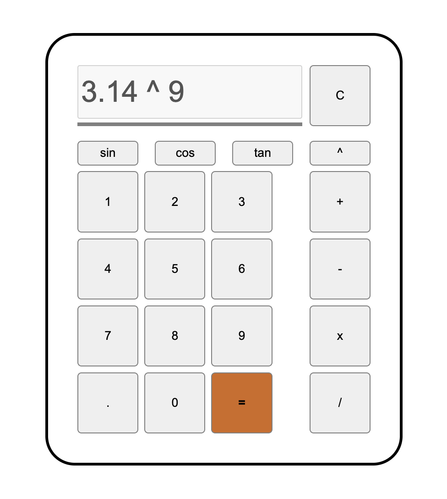
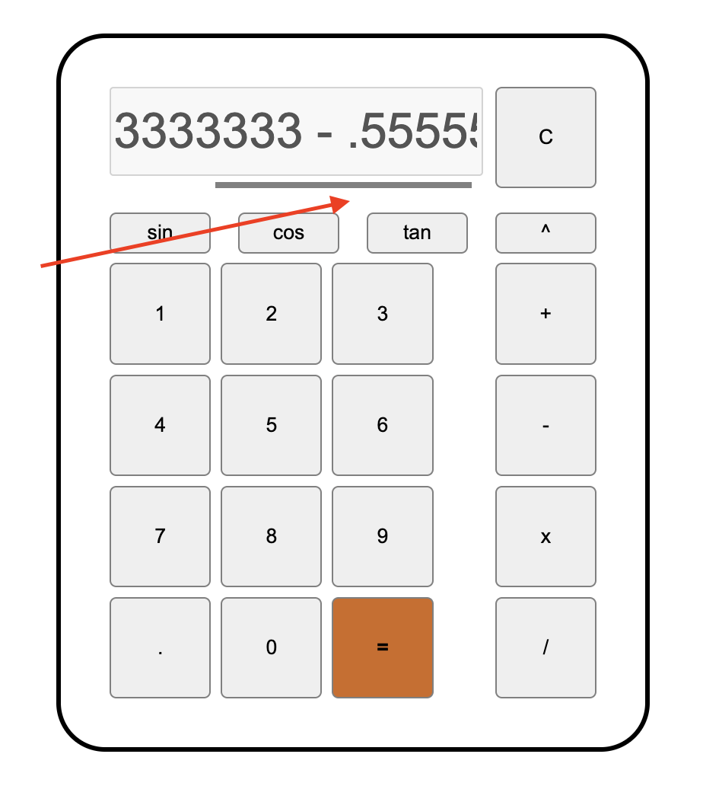

# Vanilla JS Web-Calculator

This is the final project of The Odin Project's Web Development course's introductory section. It is meant to showcase the skills learned throughout the curriculum, such as vanilla Java Script and DOM manipulation, HTML, and CSS (including Flexbox).

## Tech Stack

JavaScript, HTML, CSS

## Screenshots



```An additional feature: a functioning scrollbar in case the display gets overflown!```

